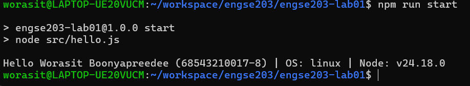

# ENGSE203 LAB01 

## ข้อมูลนักศึกษา

- ชื่อ-นามสกุล: วรสิทธิ์ บุญยปรีดี
- รหัสนักศึกษา: 68543210017-8

## Environment ที่ใช้

- ระบบปฏิบัติการ: Windows 10 + WSL 2 
- Development Environment: Visual Studio Code + WSL
- Node.js Version: v24.18.0

## วิธีติดตั้งและรันโปรแกรม

ติดตั้ง package:

```bash
npm install
npm run start
```

## หลักฐานการรันโปรแกรม



## ปัญหาที่พบและวิธีแก้ไข
-พิมชื่อไฟร์ผิด 
-วิธีแก้ไขให้ ai + เพื่อน ช่วยหาจุดที่ผิด 


## References & AI Assistance

- Source / Documentation: https://github.com/se-rmutl/engse203-lab/tree/main/labs/week-01-developer-environment-git-github
- ใช้ AI เพื่อช่วยทำความเข้าใจการติดตั้ง WSL 2, การตั้งค่า Git, SSH และการเตรียม    Development Environment